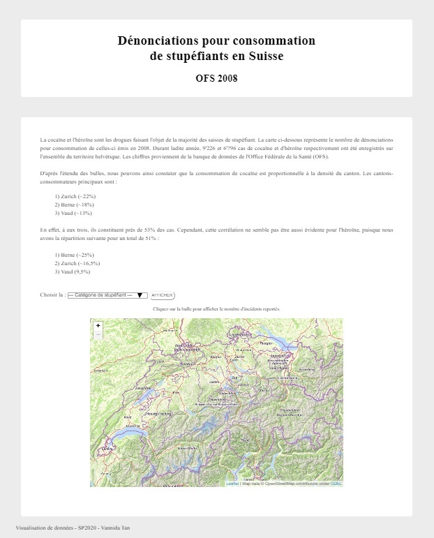
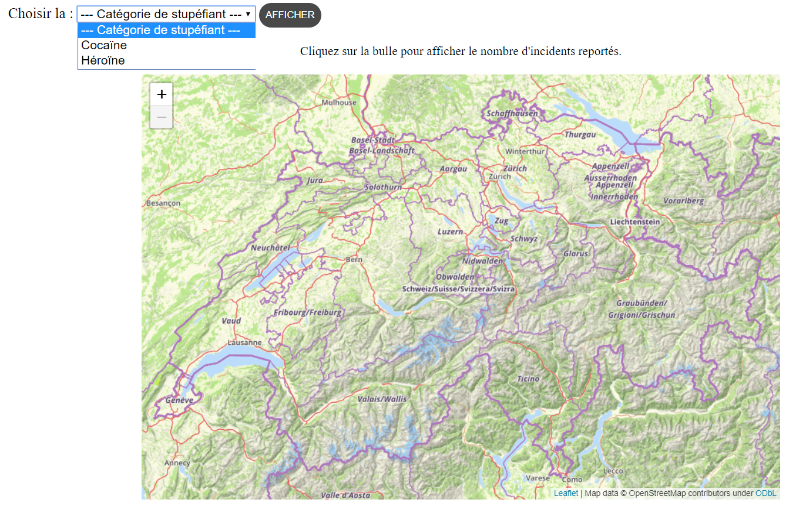
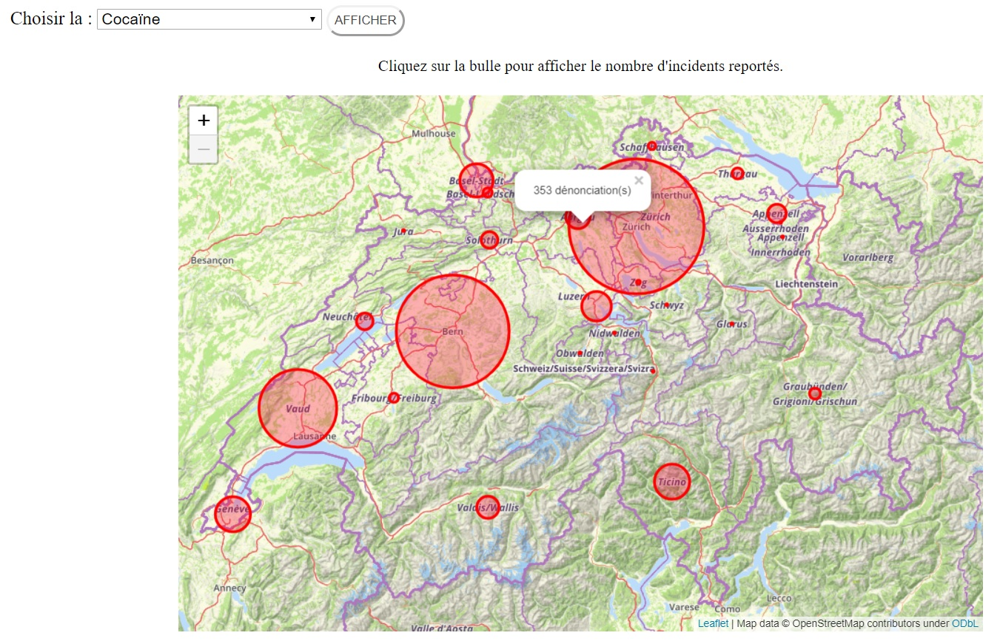
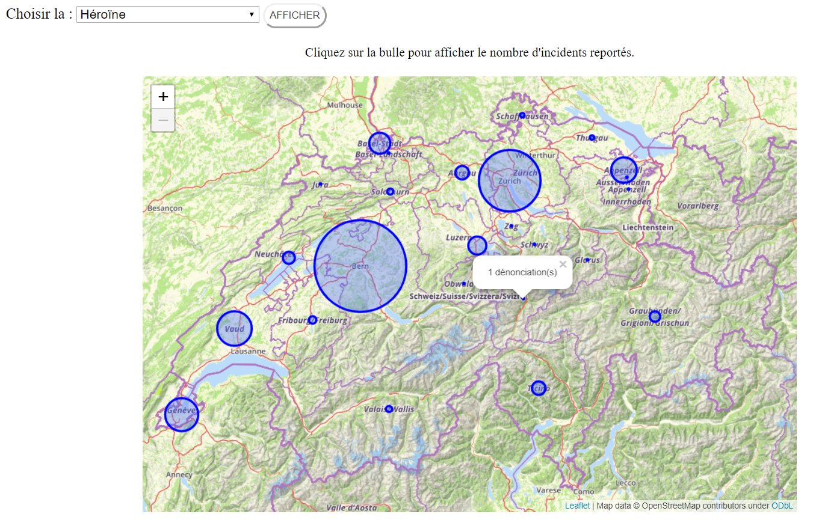

# Dénonciations pour consommation de stupéfiants en Suisse

## Description du projet

Le but est de pouvoir se représenter le volume des cas de dénonciations pour consommation de stupéfiants, ainsi que leur répartition sur tout le territoire helvétique, en 2008.

## Consultation de la page

- Sur GitHub : [lien vers la visualisation](https://vannida-t.github.io/Projet/)
- Sur un navigateur web :

    1) Télécharger le dossier depuis [GitHub](https://github.com/Vannida-T/Projet.git)
	2) Ouvrir "index.html"
	3) Au menu déroulant, choisir la catégorie désirée
	4) Valider le choix en cliquant sur le bouton "AFFICHER"
	5) Cliquer sur les bulles d'intérêt pour voir le nombre effectif de cas enregistrés

_La mise en page a été soignée de sorte à rendre la navigation agréable, que la fenêtre soit en pleine écran ou réduite._

<ins> En cas de problème avec le chargement de la page : </ins>

Voici un aperçu du rendu et des fonctionnalités.

1) L'aspect général de la page   
   
2) La sélection à afficher   
   
3) L'ampleur des dénonciations pour la cocaïne, avec un pop-up "avalé" pour exemple   
   
4) L'ampleur des dénonciations pour l'héroïne, avec un petit pop-up pour exemple   

## Choix graphique

La carte choisie semblait être la plus judicieuse en terme de visibilité et de cohérence avec les données à présenter. Elle n'est pas lourde en informations, et ni trop colorée. L'affichage de celle-ci a été limitée à la Suisse, puisque c'est la zone géographique d'intérêt. Le zoom-arrière a donc été bloqué intentionnellement. Cependant, l'utlisateur garde la possibilité de zoomer en avant s'il souhaite découvrir les villes/villages.

Les bulles sont de deux couleurs différentes pour distinguer les catégories. L'utilisateur peut sélectionner laquelle il souhaite visualiser grâce au menu déroulant.

Les variables retenues sont les stupéfiants les plus "combattus" par la police suisse, à savoir : la cocaïne et l'héroïne. Ces données datent de 2008.

### Apport de la visualisation

Ce graphique permet de se faire aisément une idée de l'ampleur des cas d'un canton à l'autre. L'affichage du nombre d'affaires effectif en pop-up est à un plus, car cela permet de :

- Ne pas surcharger la visualisation inutilement (l'utilisateur n'affiche que ce qu'il est curieux de connaître)
- Relativiser la taille des bulles (savoir ce que vaut exactement telle taille)

Ces cercles ont un fond translucides de manière à laisser transparaître le nom du canton, ainsi que les petites bulles qui "se font avaler", mais leur bord est opaque pour que le diamètre soit bien net.

## Outils de travail

- Visual Studio Code
- Statistiques de l'OFS : [fichier Excel](https://opendata.swiss/fr/dataset/verzeigungen-wegen-konsums-von-betaubungsmitteln-nach-art-der-konsumierten-mittel)
- [Leaflet](https://leafletjs.com/)
- [OpenStreetMap](https://osm.ch/)

## Auteur
Ce projet a été réalisé par Vannida Tan dans le cadre du cours _Visualisation de données_ (SP2020), donné par Monsieur Loïc Cattani à l'Université de Lausanne, avec l'assistance de Loris Rimaz.

Cours obligatoire pour le Master DCS, faculté de Droit.
